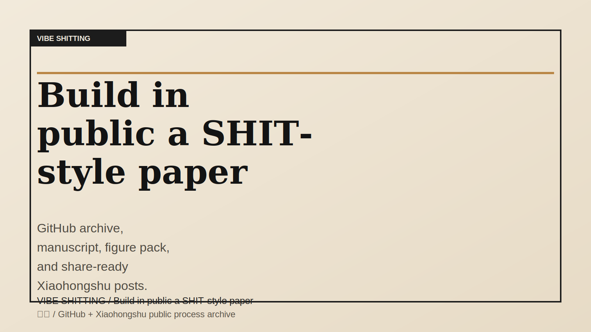

# VIBE SHITTING by 沧生

> Build in public a SHIT-style paper with vibe coding.  
> 用 vibe coding 公开创作一篇 SHIT 风格论文，并把每一步完整留档。



`VIBE SHITTING` 是一个双语公开创作项目，不是旧 `codex` 仓库的分支、子目录或换皮版本。  
`VIBE SHITTING` is a bilingual public-creation project. It is not a branch, subfolder, or reskin of the old `codex` repo.

## Start Here / 从这里开始

1. [MANIFESTO.md](MANIFESTO.md)  
   项目定位、边界和语气。  
   The positioning, boundaries, and tone of the project.
2. [ROADMAP.md](ROADMAP.md)  
   6 周执行路线、阶段输出和验收指标。  
   The 6-week execution plan, outputs, and acceptance metrics.
3. [phases/phase-00-origin/summary.md](phases/phase-00-origin/summary.md)  
   为什么要做这个项目，以及它怎样与旧项目隔离。  
   Why this project exists and how it stays isolated from the old repo.
4. [phases/phase-01-shit-style-study/summary.md](phases/phase-01-shit-style-study/summary.md)  
   SHIT 风格研究结论：它到底好笑在哪。  
   The SHIT style study: what actually makes it funny.
5. [SYNC_TO_GITHUB.md](SYNC_TO_GITHUB.md)  
   发布到 GitHub 的最短路径。  
   The shortest path to publish this repo on GitHub.

## Current Phase / 当前阶段

**Phase 05 - Canonical Submission Pack / 正式投稿包**

- Lead paper locked: `"Received, Professor": Performative Presence Survivorship Bias in Advisor Group Chats`
- Proposal: [paper/proposal/read-seen-ignored-proposal.md](paper/proposal/read-seen-ignored-proposal.md)
- English canonical manuscript: [paper/final/read-seen-ignored_submission_en.md](paper/final/read-seen-ignored_submission_en.md)
- Chinese canonical manuscript: [paper/final/read-seen-ignored_submission_zh.md](paper/final/read-seen-ignored_submission_zh.md)
- English HTML preview: [paper/final/read-seen-ignored_submission_en.html](paper/final/read-seen-ignored_submission_en.html)
- Chinese HTML preview: [paper/final/read-seen-ignored_submission_zh.html](paper/final/read-seen-ignored_submission_zh.html)
- Submission pack landing: [paper/final/read-seen-ignored_submission-ready.html](paper/final/read-seen-ignored_submission-ready.html)
- Internal editorial draft: [paper/final/read-seen-ignored_submission-ready.md](paper/final/read-seen-ignored_submission-ready.md)
- Theory framework figure: [paper/figures/theory_framework_map.svg](paper/figures/theory_framework_map.svg)
- Core bias figure: [paper/figures/performative_presence_bias.svg](paper/figures/performative_presence_bias.svg)
- Visual explainer plan: [paper/figures/visual-explainer-plan.md](paper/figures/visual-explainer-plan.md)
- SHIT fit review: [paper/review/shit-fit-review-2026-03-07.md](paper/review/shit-fit-review-2026-03-07.md)
- Core concepts glossary: [paper/review/named-effects-glossary-2026-03-07.md](paper/review/named-effects-glossary-2026-03-07.md)
- Submission metadata: [paper/final/submission-metadata.md](paper/final/submission-metadata.md)
- Latest social draft: [social/xiaohongshu/post-06-theory-upgrade.md](social/xiaohongshu/post-06-theory-upgrade.md)

当前项目已经从选题推进到 EN/ZH 双主稿的正式投稿包，并完成了一轮主概念收束。  
The lead paper has already advanced from topic selection to a dual-manuscript canonical submission pack, with the core concept now tightened into a single bias-centered argument.

## What This Repo Ships / 这个仓库交付什么

- A submission-ready SHIT-style paper package  
  一套可投稿的 SHIT 风格论文包
- A complete archive of every phase  
  每个阶段的完整决策与素材归档
- Xiaohongshu-ready share packs  
  可直接发小红书的图文脚本包
- Reusable templates and helper scripts  
  可复用模板和辅助脚本
- Reusable Codex skills for future SHIT-style paper work  
  可复用的 Codex skills，用于后续 SHIT 风格论文工作

## Why It Might Be Worth A Star / 为什么它值得一个 Star

- It is not just a story repo. It contains reusable templates for public creative research.  
  这不只是“记录一下”，而是一个可复用的公开创作方法包。
- It is bilingual from day one.  
  从第一天就是中英双语。
- It archives every decision, not only the polished result.  
  不只存成品，也存每个阶段的判断过程。

## Repo Map / 目录结构

```text
vibe-shitting/
  README.md
  ROADMAP.md
  MANIFESTO.md
  CONTRIBUTING.md
  phases/
  paper/
  social/
  assets/
  templates/
  scripts/
  skills/
  .github/
```

### Key Subsystems / 关键子系统

- `phases/`: one folder per stage, each with `summary.md`, `decision-log.md`, `share-pack.md`, and `artifacts/`
- `paper/`: topic matrix, abstract, outline, draft, figures, references, final package
- `social/`: ready-to-post Xiaohongshu copy and GitHub updates
- `templates/`: repeatable scaffolding for future phases and posts
- `scripts/`: helper tools for creating new phases and checking structure
- `skills/`: reusable Codex skills extracted from the project's repeated workflows

## Contribution Loop / 参与方式

- Star the repo if you want the project to keep going.  
  想看这个项目继续做下去，可以先点个 star。
- Open a topic vote issue if you want to push a different paper idea.  
  想推动别的论文题目，可以开一个 topic vote issue。
- Suggest slide structure, hook lines, or title variants.  
  你也可以直接贡献标题、图文页结构或评论区钩子。
- Help translate or polish bilingual copy.  
  也欢迎帮忙校对中英双语文案。

See [CONTRIBUTING.md](CONTRIBUTING.md) for the working rules.

## Boundaries / 边界

This project is satire with method. It must stay away from:

- real politics and real-world geopolitical bait
- dangerous crime or medical instructions
- doxxing, harassment, or attacks on real people

这个项目是“带方法的讽刺”，不是拿现实危险内容开玩笑。

## Related Work / 相关项目

The older `codex` repo is related only in the broad sense of public experimentation.  
旧 `codex` 仓库只在“公开实验”这个大方向上相关。

This repository is a separate brand, separate archive, separate creative workflow.  
这个仓库是独立品牌、独立归档、独立创作工作流。
