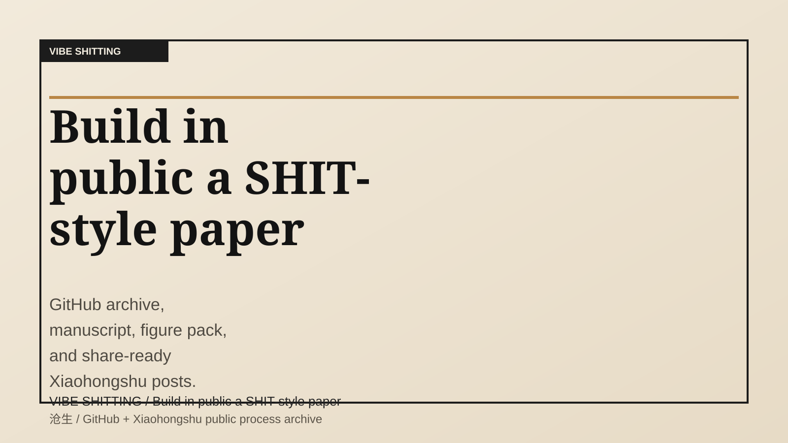

  

A SHIT-style paper on advisor group-chat reply latency.

## Manuscripts

- Chinese manuscript: [paper/final/read-seen-ignored_submission_zh.md](paper/final/read-seen-ignored_submission_zh.md)
- English manuscript: [paper/final/read-seen-ignored_submission_en.md](paper/final/read-seen-ignored_submission_en.md)
- Chinese HTML preview: [paper/final/read-seen-ignored_submission_zh.html](paper/final/read-seen-ignored_submission_zh.html)
- English HTML preview: [paper/final/read-seen-ignored_submission_en.html](paper/final/read-seen-ignored_submission_en.html)
- Submission cover letter: [paper/final/submission-cover-letter_zh.md](paper/final/submission-cover-letter_zh.md)
- Upload form copy text: [paper/final/submission-form-copy_zh.md](paper/final/submission-form-copy_zh.md)

## Submission Package

- Final upload package: [dist/submission/shit_submission_20260507/](dist/submission/shit_submission_20260507/)
- ZIP archive: [dist/submission/shit_submission_20260507.zip](dist/submission/shit_submission_20260507.zip)

## Figure Pack

- [paper/figures/latency_diligence_curve.svg](paper/figures/latency_diligence_curve.svg)
- [paper/figures/hierarchy_window_chart.svg](paper/figures/hierarchy_window_chart.svg)
- [paper/figures/first_responder_discount.svg](paper/figures/first_responder_discount.svg)
- [paper/figures/role_species_windows.svg](paper/figures/role_species_windows.svg)
- [paper/figures/publication_burden_u_curve.svg](paper/figures/publication_burden_u_curve.svg)
- [paper/figures/red_envelope_shock.svg](paper/figures/red_envelope_shock.svg)

## Social Pack

- Xiaohongshu-ready drafts: [social/xiaohongshu/README.md](social/xiaohongshu/README.md)
- Project structure: [PROJECT_STRUCTURE.md](PROJECT_STRUCTURE.md)

## Archive

- Internal bilingual working draft: [paper/final/read-seen-ignored_submission-ready.md](paper/final/read-seen-ignored_submission-ready.md)
- Legacy retired branch: [paper/archive/2026-03-retired-snapshots/README.md](paper/archive/2026-03-retired-snapshots/README.md)
