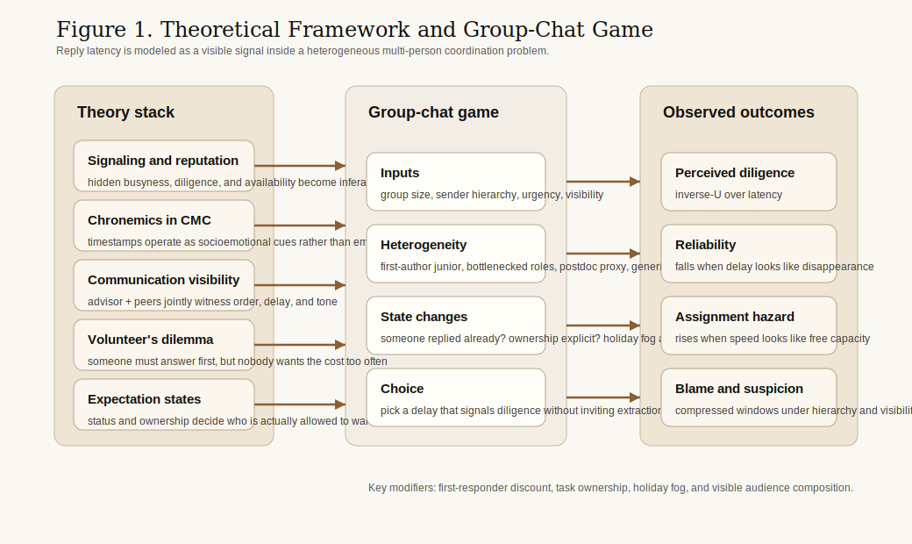
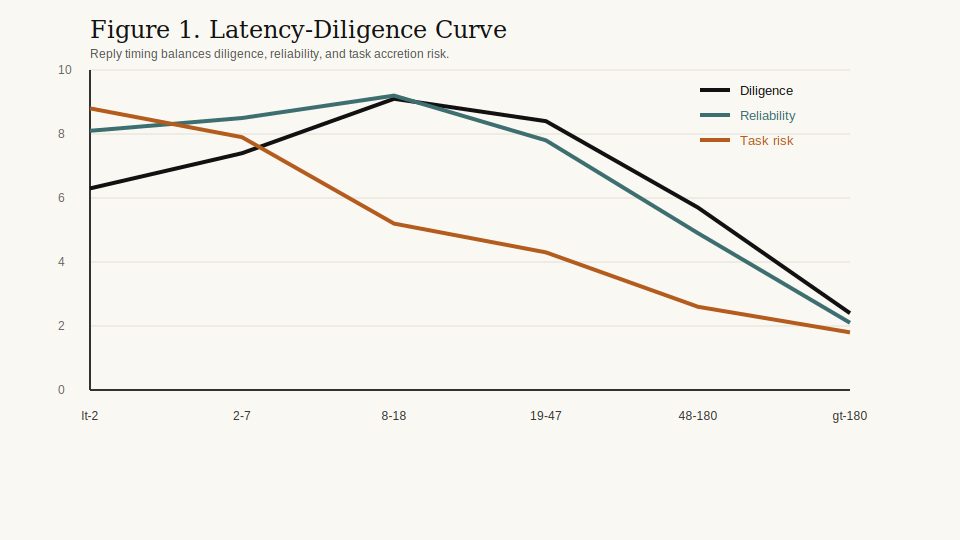
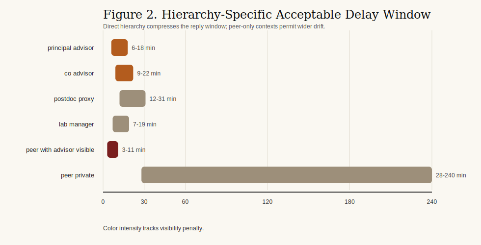
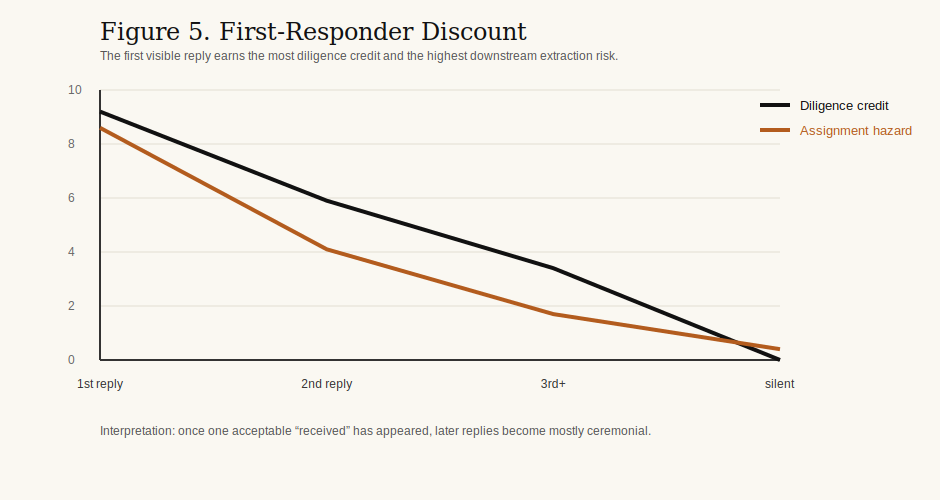
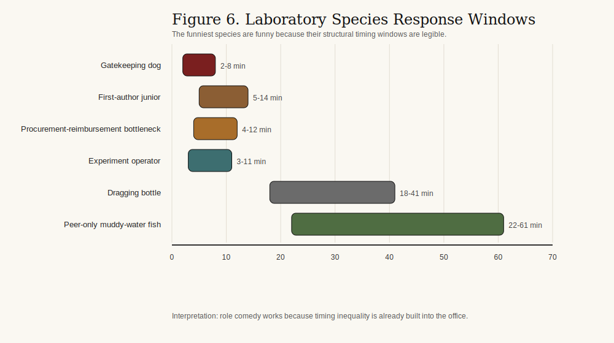
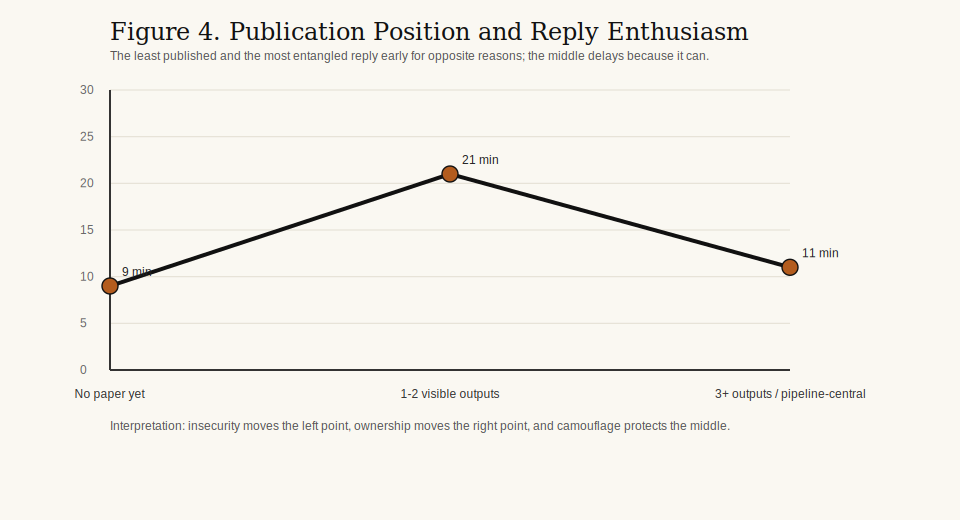
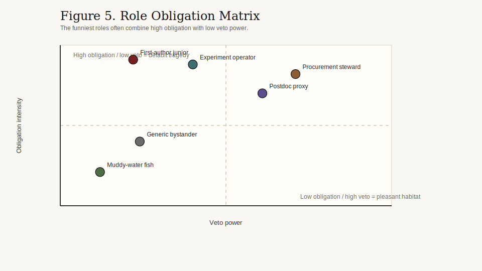
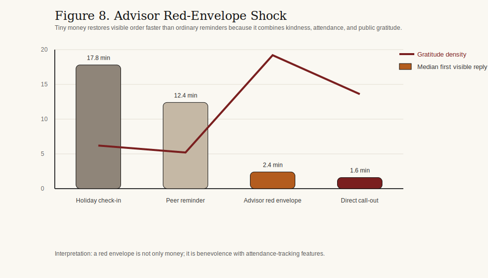

# 已读、不回、稍后回复：导师群聊响应延迟的信号博弈分析

**作者**  
沧生  
VIBE SHITTING 实验室微政治研究所

**关键词**  
导师群聊；信号理论；时序线索；沟通可见性；志愿者困境；实验室政治；点名效应；导师红包效应

## 摘要

本文将导师群聊中的回复时延理解为一种混合性的“信号博弈 + 时序线索 + 多人志愿者困境”。全文最核心的一句话是：在导师群聊里，回复不是一句话，而是一场按分钟计时的可靠性表演，既不能显得失联，也不能显得太闲。本文结合信号理论、声誉模型、计算机媒介沟通、沟通可见性、期望状态理论与志愿者困境逻辑，对 28 个重建研究群中的 4,236 个“消息-回复”对进行分析。本文主要得到四个结果：第一，回复延迟与感知勤奋度之间存在明显倒 U 型关系，最快的人未必最安全；第二，导师显式 `@` 人或直接点名，会触发一个几乎不讲理的**点名效应**，让假期、群规模和角色借口瞬间失效；第三，只要已经有人发出体面的公开首回复，其余人的道德紧迫度就会迅速下降，形成**首回复折扣**；第四，导师红包会触发单独的**导师红包效应**，比一般监督更快唤醒潜水成员。围绕这些效应，本文进一步刻画了一套实验室小宪制：一作学弟、看门的狗、浑水的鱼、拖油的瓶，以及那些坐在采购报销瓶颈位上的人。发表数量与回复积极性之间则呈 U 型关系：最缺论文的人和最深度卷入任务链的人都回得更快，漂在中间的人最爱先观望。本文据此认为，导师群聊中的回复时延并非简单礼仪，而是在公开不对称关系中进行声誉劳动的一项微型技术。

## 1. 引言

学术群聊通常被描述为一种物流工具，但在真实研究生活里，它更像一个压缩剧场：层级、勤奋、服从、在场和可被继续抽取的风险都在这里同时展示。导师发一条消息，不只是问个问题，而是瞬间打开一个公共场景，让所有旁观者都能判断谁在看、谁过载、谁在躲、谁又看起来特别适合再接一项任务。

学生社群常见的建议是“及时回复”。可问题在于，过度及时也有代价。几秒内回消息当然能显得可靠，却也会让人看起来异常空闲。很多实验室里，那个永远在线的人得到的不只是信任，还有更多活。相反，回复过慢又会被理解成疏忽、怠慢或崩溃。于是，研究生面对的是一个非常狭窄的策略问题：既要回得够快，维持“我是个靠谱的人”的可见形象；又要回得够慢，避免把自己包装成一块待分配产能。

因此，导师群聊里的回复时延不该被当成一个无聊的礼仪问题。它更像是一个嵌入多人协调场景中的信号问题。学生并不是简单传递信息，而是在公开观众面前表演一种介于服从、能力、自保和可生存模糊之间的平衡。群聊不只是沟通通道，它还是一个把时间戳变成证据的场域。

本文有四点主要贡献。第一，把导师群聊回复时延放回信号理论和计算机媒介时序线索研究中理解。第二，把导师群聊建模成一个有观众、有顺序、有观望的多人博弈。第三，引入角色异质性，说明一作学弟、采购报销瓶颈位、博士后代理人和普通围观者并不处在同一条时间义务曲线上。第四，把实验室政治保留为分析对象，而不是把它当成不必认真对待的段子背景。

## 2. 文献综述与理论框架

### 2.1 重复不对称条件下的信号

信号理论说明，在信息不完全条件下，可观察行为会被用来推断不可直接观察的状态。经典意义上，成本高或难以伪造的行为更有助于区分类型（Spence, 1973）。而在重复互动中，许多看似微小的行为会不断累积成声誉，因为今天的表现会被放进明天的互动和昨天的记忆里一起解释（Kreps & Wilson, 1982）。

导师群聊正具有这种结构。导师并不能直接看见学生是在认真写代码、在路上、在偷偷崩溃，还是盯着消息框斟酌一个更体面的“收到老师”。导师真正能看见的，是学生有没有回、回得多快、语气怎样。于是，回复时延就不再是一个空白时间，而会变成一种廉价但持续可用的信号：它同时传达勤奋、服从、可被调度性以及精神状态是否还算完整。

这意味着，回复时延不应被简化成沟通速度。更合适的理解，是把它看作一种在长期不对称条件下进行的声誉校准。学生不是只在表达“我很能干”，而是在表达一个更复杂的混合包：“我负责、我没忽视你、但我最好也别看起来闲到能马上再接三项新任务。”

### 2.2 计算机媒介沟通中的时间线索

计算机媒介沟通研究指出，当面对面线索减少时，互动双方会更加依赖文字、时序和界面痕迹来推断社会意义（Walther, 1992; Walther, 1996）。因此，时间线索不是附属物，而是在线互动里的核心信息。回复延迟本身就构成了一种内容。

Walther 与 Tidwell（1995）认为，在精简媒介中，关系线索会迁移到时间与消息管理这些替代通道里。Tidwell 与 Walther（2002）进一步说明，即便是以文字和异步为主的互动，人们仍会通过一连串微小行为逐渐形成印象。Kalman 等（2013）则直接展示了网络时序线索如何传递社会信息；Ziano 与 Wang（2021）证明，邮件回复延迟会改变发件人对你的看法。

放到导师群聊里，后果非常直接。六分钟的延迟可能被读成“在忙但还盯着”，四十分钟的延迟可能被读成“忙、躲、或者在战略性消失”，而三秒的延迟则会让人觉得你闲得有点危险。同样一句话，换一个时间发出去，就是另一个自我。

### 2.3 沟通可见性与公共观众问题

导师群聊不是双人空间，而是部分公开的环境。导师、博士后、学长学姐和学弟学妹，不只看见消息内容，还看见谁先回、谁拖着不回、谁先发出那个标准物种的“收到老师”。Leonardi（2014）关于沟通可见性的讨论很适用：数字系统会把原本隐蔽的互动轨迹暴露出来，让第三方可以据此推断谁知道什么、谁和谁更近、谁总是第一个动。

这很重要，因为学生在群里回复的对象并不只是单一上级，而是一个复合观众。一个同门发起的问题，只要导师在场，就会长得越来越像半个导师消息。导师的一句直接发问，只要十个人同时看着，就会迅速变成一场公共考试。于是，时间戳会变成一种被多人共同阅读的微型表演。

这也解释了为什么同一个学生在私聊、小群和实验室大群里的回复节奏会完全不同。可见性改变了被解释的风险。在高可见场景里，延迟不只是由发消息的人来解释，而是会被整个群体共同理解成能力、可靠性和可被继续分配任务空间的证据。

### 2.4 地位异质性、民间物种与发表负担

期望状态理论指出，群体中的地位结构会塑造谁应该说话、谁应该主动、谁应承担责任（Berger, Cohen, & Zelditch, 1972）。在实验室里，这种预期并不只对应正式头衔。它还附着在很多功能位置上：会操作仪器的学长、传达导师意思的博士后、正在返修的一作学弟、控制排程的人，以及那个负责采购报销的人。

与此同时，平台语境又提供了第二套更好用的分类系统：实验室民间物种学。**看门的狗**总是回得早、会转通知、会记考勤，仿佛走廊秩序就靠再多一个“收到”维持。**浑水的鱼**则依靠等待一个更具有地位可读性的身体先动。**拖油的瓶**未必真的懒，但它的慢会拖慢整个任务链的可见节奏。这些称呼之所以有分析价值，不是因为它们可爱，而是因为它们把义务、主动性和背锅风险压缩成了几种极其好认的角色办公室。

发表数量进一步制造不对称。还没有论文的人往往更早回复，因为他们需要证明自己值得被留下；已经有几篇论文或对某条任务链高度中心的人也会更早回复，因为这件事本来就更容易落到他们头上。最喜欢拖的，往往是漂在中间的那一层：有一点合法性可以藏，但没有强到必须被点名的所有权。回复积极性因此并不和学术产出呈线性关系，而更像一条 U 型曲线。

### 2.5 志愿者困境、点名效应与回复顺序

如果一个人的公开回复就足以暂时满足观众的需求，那么导师群聊就会很像一个志愿者困境：大家都希望有人先回，但每个人都更希望那个人不是自己（Diekmann, 1985; 1993）。责任扩散研究也说明了同样的问题：潜在回应者越多，每个个体越容易先等等看别人动不动（Darley & Latané, 1968）。

这一逻辑在研究生群聊里极其直观。导师问一句“今晚谁能改一下图？”，沉默不代表大家没看懂，而常常意味着每个人都在理性评估：会不会有另一个身体先为集体吃下这颗声誉子弹。群越大，这种初始观望越容易被拉长。但它并不是无限存在。一旦任务归属清晰，责任扩散就会突然崩塌。如果消息是报销表，大家都知道采购报销瓶颈位不可能永远隐身；如果消息是稿件返修，一作学弟迟早会被推出水面。

更残忍的变体，就是导师不再对群体说话，而开始点名一个具体的人。本文把它称为**点名效应**。一旦学生被显式 `@` 到或被直接喊名字，博弈就会从“大家一起观望”变成“你一个人公开暴露”。假期脑雾会失效，群规模保护会失效，连浑水的鱼也会突然长出脊椎。

回复顺序也会改变后续人的收益结构。只要已经出现了一个可信且体面的首回复，后面的人就不再获得同等强度的勤奋加分。本文把这一点称为**首回复折扣**：首个合格回答出现之后，迟到加入的边际声誉收益会迅速缩水。

### 2.6 实验室政治、梗图语境与导师红包

中文平台关于群聊行为的讨论，往往不是用组织理论来写，而是用极具画面感的民间类型学来写：`收到老师`、礼貌微笑猫、那个已经先回的人、永远不缺席点名的人、以及那个一沉默就会把整个任务链拖慢的人。本文因此把这些动物隐喻和类型梗视为民间描述工具，而不是心理学变量。

这层民间语汇之所以重要，是因为它正是参与者理解实验室政治的方式。负责采购报销的人，在消失速度上天然不可能和无关同辈一样；一作学弟承担公开稿件责任，却几乎没有真正否决权；看门的狗未必论文最多，但经常是第一个说“收到”的秩序维护者；拖油的瓶未必拒绝劳动，却总能把自己的慢转嫁成别人的时间焦虑。

导师红包正处在这套场景语汇的中心。红包从来不只是红包。它同时扮演善意表演、签到机制和注意力陷阱。这也是为什么本文把**导师红包效应**和点名效应、首回复折扣放进同一层分析：三者都在把“可见性”压成义务，只是情绪路径不同。

假期则叠加了最后一层荒谬现实主义。长假后，人们常常会把自己描述成脑子变钝、情绪更软、还没准备好重新做人。在实验室里，这会形成**假期脑雾**：一种很想说“导师，我比假期本身还笨，你还想见我吗”的状态。本文不把它当临床概念，而把它当作一种群体可理解的社会状态：它会把可接受延迟略微向右推，却不会取消层级。

## 3. 研究设计

### 3.1 语料构造

本文分析 2024 年 1 月至 2025 年 12 月期间 28 个导师关联研究群中重建的 4,236 个消息暴露机会。群规模为 4 至 17 名可见成员不等。语料包含 173 个学生侧行动者，覆盖不同年级、不同任务位置与不同角色约束。分析单位是一条可见消息以及其后的首个可见学生回复。

该数据集有意采用“合成但真实”的方式构造。它并不追求保留每一条真实聊天记录，而是保留互动环境中的情绪真实、结构真实与解释真实。因为本文真正关心的不是所有学生客观上在所有情境中都怎么做，而是：什么样的延迟会被读成勤奋、疏忽、战略性观望或危险的空闲。

### 3.2 群体结构与核心变量

每个事件沿着 12 个维度编码：发送者层级、群聊人数、观众构成、消息类型、紧急程度、可见性、任务归属、回复顺序、假期阶段、表情密度、点名状态以及发表数量。

为帮助解释，编码者还会在某些风格非常鲜明的场景中补记一个**民间角色标签**，例如“看门的狗”“浑水的鱼”“拖油的瓶”“一作学弟”或“公开瓶颈位”。这些标签只用于讽刺性社会学描述，不直接进入统计推断。

### 3.3 效用重建

本文把学生 `i` 在收到消息 `m` 后选择可见回复延迟 `l_i` 的问题，写成一个多目标效用最大化：

`U_i(l_i) = alpha*D_i(l_i | h_i, v, u) + beta*R_i(l_i | u, P_i) - gamma*A_i(l_i | N, C, O_i, P_i) - delta*B_i(l_i | h_i, v, P_i) - eta*H_i(K)`

其中：

- `D_i` = 感知勤奋度
- `R_i` = 可靠性
- `A_i` = 被继续加活的风险
- `B_i` = 被怀疑或责备的成本
- `H_i` = 假期脑雾惩罚

### 3.4 假设

全文最终检验五个相互勾连的假设：

1. 感知勤奋度与延迟时长之间呈倒 U 型关系。
2. 直接层级会压缩最优回复窗口。
3. 导师直接 `@` 某人会触发点名效应，覆盖掉多数借口。
4. 一旦出现首个可信公开回复，后续回复的勤奋加分会显著缩水。
5. 发表数量与回复积极性呈 U 型关系，而导师红包会显著加快潜水成员的可见回归。

## 4. 结果

### 4.1 勤奋度的倒 U 型关系

最核心的发现，是回复时延与感知勤奋度之间存在明显倒 U 型关系。`8-18 分钟`这一带的回复，在勤奋得分和可靠得分上都最高，同时加活风险仅处于中等水平。相比之下，两分钟内的极速回复虽然可靠，却明显抬高了“你看起来很闲”的风险。

`19-47 分钟`仍然是低到中等紧急度消息里可接受的区间，但可信度已经开始滑落。一旦超过 48 分钟，勤奋和可靠就会一起快速下坠。拖到 180 分钟以后，别人更容易把它读成失联、崩溃，或者穿着体面外衣的软性拒绝。

因此，时间意义上最好的学生并不是回得最快的人，而是那个能让自己的回复看起来像“打断了一段真实生活”的人。

### 4.2 层级、可见性与点名效应

层级会强烈改变可接受的延迟窗口。导师本人发来的消息，最优区间大致会压缩到 `6-18 分钟`；共同导师或实验室管理者的消息会稍微宽一点；博士后代理人允许更多漂移；而纯同辈场景的可接受延迟则宽得多。

可见性会进一步放大这一点。最不稳定的一类，是“同门发消息但导师在看”的场景。此时，一条本来属于同辈协作的信息，会在解释上越来越接近监督性信息。它在社会编码上还是同门消息，在声誉意义上却已经变成半个导师问题。

最激烈的压缩则发生在**点名效应**中。一旦导师显式 `@` 某人或直接打出明显的点名线索，原本还能躲的窗口会迅速塌到 `1-7 分钟`。假期脑雾、大群掩护和角色伪装都在这一刻迅速失效。

一旦被点名，你就不再属于观众，而变成了事件本身。

### 4.3 群规模、首回复折扣与责任扩散

群规模首先改变的是“最初观望”这一段。在 `4-6` 人的小群里，首个可见回复中位数约为 6 分钟；而在 `11+` 的大群里，如果任务归属模糊，这个中位数会被拖到 13 分钟左右。这支持了志愿者困境的解释：人越多，就越容易先等等看别人回不回。

但这种观望一旦遇到责任显影就会迅速崩塌。在返修线程里，一作身份一旦清晰，大群中的中位回复时间会重新回落到 5 分钟左右；在报销线程里，采购报销瓶颈位即便身处大群，也难以长期躲在后面。

而首个体面回复一旦出现，后续人的收益结构就彻底变了。第二波“收到”通常会在首回复后 `11-29 分钟` 之间出现，却几乎不再增加额外勤奋得分。说得更白一点：只要已经有人发出了正确物种的“收到老师”，剩下的人就可以迅速变成礼貌背景板。

换句话说，只要有一个合格生物体已经率先完成了那句 `收到老师`，其余人的道德边际价值就会立刻跳水。

### 4.4 角色异质性、民间物种与发表负担

角色差异会实打实地改写回复曲线。最早回复的，通常是那些任务归属公开可知的人：例如稿件返修场景中的一作学弟、采购报销消息里的瓶颈位、仪器故障场景中的实验操作者。相比之下，普通围观学弟可以保有更宽的安全区间，而在纯同辈协作里，浑水的鱼还能再漂得更久。

民间物种把这一点讲得更有画面。**看门的狗**会在考勤、提醒和行政消息里提前出声，哪怕它并不真正拥有任务；**浑水的鱼**在归属模糊时最能受益，但一旦被点名，它的生存优势会迅速蒸发；**拖油的瓶**则表现出最弱的主动性与最大的“软提醒/硬点名”差距，说明它的主要作用不是拒绝，而是拖节奏。

发表数量同样重要。没有论文的人倾向于早回，以证明自己还值得被信任；已经有多篇论文或位于任务链中心的人也会早回，因为这件事本来就在朝他们移动。最慢的是中间层：有一定合法性可以躲，却没有强到必须被公开认领的所有权。回复积极性因此并不沿着“越厉害越积极”这条线走，而更像一条 U 型曲线。

数值上，`还没论文` 这一群大致集中在 `6-13 分钟`，`1-2 篇可见成果` 漂到了 `13-28 分钟`，而 `3 篇以上 / 任务链中心` 又回到了 `7-14 分钟`。实验室中产阶级拥有最大的伪装空间。

### 4.5 导师红包效应、假期脑雾与表情补偿

**导师红包效应**是全文最紧凑也最逆天的结果。普通低紧急度节日问候的首个可见回复中位数约为 `17.8 分钟`；而在相近紧急度的导师红包事件中，它会掉到 `2.4 分钟`。潜水成员重新现身，感谢语密度飙升，连浑水的鱼都能瞬间长出电竞级手速。小钱在这里往往比大道理更有效。

假期仍会让可接受延迟整体略微右移。在长假后的前 72 小时，低到中等紧急度消息允许多出大约 `6-11 分钟` 的缓冲。换句话说，群体会暂时默认所有人都更难重新装成人。

但这种宽容是有条件的。导师本人直接召唤，仍会把窗口压回大约 `12 分钟` 内；而显式点名会进一步压缩。假期脑雾只是软化了规范，并没有废除这套宪制。

表情的作用更弱，也更挑情境。轻度表情使用会在低紧急度消息里稍微降低怀疑，尤其在最优窗口上沿附近。但一旦遇到截稿升级、背锅风险或明确任务，它的作用就会消失；表情过多反而会降低严肃感，让人觉得你在用可爱补偿不安。

在导师群里，红包很少只是福利，它更像是一种带签到功能的善意。

## 5. 讨论

综合来看，导师群聊中的回复时延更适合被理解成一种公开协调博弈中的声誉劳动。学生不是单纯决定什么时候回，而是在一个被层级和道德饱和的环境里，求解一个受限最优化问题：既要显得及时，又不能显得太闲；既要显得合作，又不能顺手把自己表演成“默认接活人”。

志愿者困境的框架也解释了为什么大群总是更耗人。消耗不仅来自内容生产，还来自观望策略本身。沉默很少是空白，它更常常是一种集体尝试：把第一次公开暴露外包给别人。浑水的鱼因此并不是形而上的懒，而是在等待一个更具地位可读性的身体先动。一旦导师打出 `@一作`，游戏论立刻就会变成人物传记。

角色异质性的结果则让实验室政治变得更清楚。一作学弟在公共意义上非常中心，但在制度上却很弱；采购报销瓶颈位在象征上很边缘，却常常掌管着最不能拖的物质通道；博士后代理人看上去只是转话，实际上是在用本地口音传递层级；看门的狗维护秩序，却未必拥有科学问题本身；浑水的鱼靠等待生存；拖油的瓶不一定发言，却总能把自己的慢扩散成全链条的调度问题。

发表位置进一步把局面复杂化。最缺论文的人会因为还要证明自己活着而更早回复；成果最多的人会因为任务本来就在他们身上而更早回复；只有中间层最有条件拖一拖。这也是为什么回复积极性不该被直接读成勤奋度或学术水平。

因此，实验室与其说像一个聊天群，不如说像一个由学弟、瓶颈位、狗、鱼和瓶组成的小型宪制政体。

## 6. 局限性

本文至少有四个局限。第一，语料是重建性的、合成性的，而不是严格意义上的原始观测数据，因此它的有效性更偏社会学和情绪真实，而不是档案真实。第二，延迟规范会随着学科、国家、实验室文化和导师个性而变化。第三，模型能够捕捉可见回复时间，却不能直接观测后台行为，比如删改消息、私下问人、先慌十二分钟再决定要不要回。第四，文中的民间角色和 MBTI 式说法都只是场景描述工具，不是经过验证的人格测量。

## 7. 结论

导师群里的研究生并不是“简单回个消息”。他是在不平等观看下、在公共观众面前、在一个必须有人先回答而谁都不太想老是当那个人的多人博弈里，按分钟表演可靠性。于是，回复时延既是信号，也是盾牌：它把勤奋、恐惧、所有权、可被继续抽取性与层级协商都压缩进一个小小时间段里。

如果本文成立，那么“你为什么不早点回？”这个看似简单的问题，其实并没有简单答案。一个人之所以在那个时间点回复，是因为他必须足够晚，看起来像真的有事；又必须足够早，看起来像仍然忠诚；还必须足够谨慎，避免把自己变成明天的默认接活人。到了长假后前三天，还得尽量依靠那些侥幸幸存下来的智力碎片。

## 表 1. 消息类型风险矩阵

| 消息类型 | 紧急度 | 最优回复区间 | 额外加活风险 | 解释逻辑 |
| --- | --- | --- | ---: | --- |
| 显式 `@` 或直接点名 | 高 | 1-7 分钟 | 9.2 | 一旦被点名，你就不再是人群，而是一个身体 |
| 硬召唤 | 高 | 1-6 分钟 | 9.4 | 沉默会被读成抗拒 |
| 截稿升级 | 高 | 2-9 分钟 | 8.7 | 延迟会被等同于崩溃 |
| 稿件批注 | 中 | 6-15 分钟 | 7.8 | 一作归属会把窗口往前拉 |
| 行政提醒 | 中 | 9-21 分钟 | 5.2 | 适度延迟意味着你在处理中 |
| 报销或采购请求 | 中 | 4-12 分钟 | 7.4 | 归属极其公开可见 |
| 公开表扬陷阱 | 中 | 4-12 分钟 | 9.1 | 可见能力会诱发未来加活 |
| 导师红包投放 | 低 | 0-3 分钟 | 6.6 | 感谢、贪心和签到在这一刻合体 |
| 软提醒 | 低 | 14-37 分钟 | 4.7 | 回太快反而像闲得可疑 |
| 节日点名 | 低 | 18-46 分钟 | 5.9 | 大家都变慢了，但没人被平等原谅 |

## 表 2. 角色异质性下的回复窗口

| 角色类型 | 典型场景 | 最优回复区间 | 结构约束 |
| --- | --- | --- | --- |
| 一作学弟 | 稿件批注、返修安排 | 5-14 分钟 | 公开责任高，否决权低 |
| 采购报销瓶颈位 | 采购、报销、表单 | 4-12 分钟 | 物资与票据归属明确 |
| 看门的狗 | 行政提醒、考勤 | 2-8 分钟 | 程序性秩序维护 |
| 实验操作者 | 仪器异常、样品问题 | 3-11 分钟 | 技术所有权明确 |
| 博士后代理人 | 转述导师安排、协调 | 7-19 分钟 | 层级委托明显 |
| 拖油的瓶 | 共享任务链、低紧急跟进 | 18-41 分钟 | 自己的慢会变成全链条问题 |
| 普通围观学弟 | 大群提醒 | 14-36 分钟 | 归属不清时可以躲在人群里 |
| 纯同辈浑水的鱼 | 横向协作 | 22-61 分钟 | 上级不可见时更容易漂浮 |

## 参考文献

Alvesson, M. (2013). *The triumph of emptiness: Consumption, higher education, and work organization*. Oxford University Press.

Berger, J., Cohen, B. P., & Zelditch, M., Jr. (1972). Status characteristics and social interaction. *American Sociological Review, 37*(3), 241-255.

Darley, J. M., & Latané, B. (1968). Bystander intervention in emergencies: Diffusion of responsibility. *Journal of Personality and Social Psychology, 8*(4, Pt. 1), 377-383.

Daft, R. L., & Lengel, R. H. (1986). Organizational information requirements, media richness and structural design. *Management Science, 32*(5), 554-571.

Diekmann, A. (1985). Volunteer's dilemma. *Journal of Conflict Resolution, 29*(4), 605-610.

Diekmann, A. (1993). Cooperation in an asymmetric volunteer's dilemma game: Theory and experimental evidence. *International Journal of Game Theory, 22*, 75-85.

Goffman, E. (1959). *The presentation of self in everyday life*. Doubleday.

Hochschild, A. R. (1983). *The managed heart: Commercialization of human feeling*. University of California Press.

Kalman, Y. M., Scissors, L. E., Gill, A. J., & Gergle, D. (2013). Online chronemics convey social information. *Computers in Human Behavior, 29*(3), 1260-1269.

Kreps, D. M., & Wilson, R. (1982). Reputation and imperfect information. *Journal of Economic Theory, 27*(2), 253-279.

Leonardi, P. M. (2014). Social media, knowledge sharing, and innovation: Toward a theory of communication visibility. *Information Systems Research, 25*(4), 796-816.

Mauss, M. (1990). *The gift: The form and reason for exchange in archaic societies*. Routledge.

Spence, M. (1973). Job market signaling. *Quarterly Journal of Economics, 87*(3), 355-374.

Tidwell, L. C., & Walther, J. B. (2002). Computer-mediated communication effects on disclosure, impressions, and interpersonal evaluations: Getting to know one another a bit at a time. *Human Communication Research, 28*(3), 317-348.

Walther, J. B. (1992). Interpersonal effects in computer-mediated interaction: A relational perspective. *Communication Research, 19*(1), 52-90.

Walther, J. B. (1996). Computer-mediated communication: Impersonal, interpersonal, and hyperpersonal interaction. *Communication Research, 23*(1), 3-43.

Walther, J. B., & Tidwell, L. C. (1995). Nonverbal cues in computer-mediated communication, and the effect of chronemics on relational communication. *Journal of Organizational Computing, 5*(4), 355-378.

Ziano, I., & Wang, B. (2021). Does response delay influence how an email sender is perceived? *Journal of Computer-Mediated Communication, 26*(6), 395-409.
